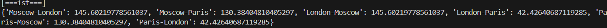
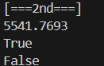
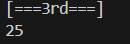
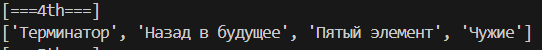
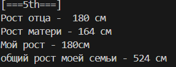
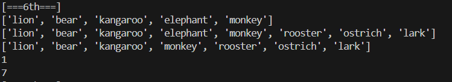
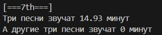
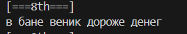
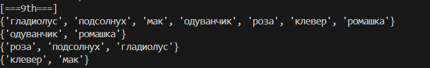
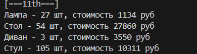

# Задание 0
## Задание
Есть словарь координат городов. Нужно составить словарь словарей расстояний между ними, используя формулу
$$ d = \sqrt{(x_1 - x_2)^2 + (y_1 - y_2)^2} $$
## Описание работы
Создадим цикл for, в котором используем город А и его координаты, внесём пустой список. 
Далее, с помощью второго for, для каждого firstSite подберём secondSite, после чего вычислим расстояние по формуле и внесём в список.
```python
distances = {}
for firstSite in sites.keys():
    for secondSite in sites.keys():
        if(firstSite == secondSite):
            continue
        name = firstSite + "-" + secondSite
        distances[name] = ((sites[firstSite][0] - sites[secondSite][0]) ** 2 + (sites[firstSite][1] - sites[secondSite][1]) ** 2) ** 0.5
```
Результат: `{'Moscow-London': 145.60219778561037, 'Moscow-Paris': 130.38404810405297, 'London-Moscow': 145.60219778561037, 'London-Paris': 42.42640687119285, 'Paris-Moscow': 130.38404810405297, 'Paris-London': 42.42640687119285}`
## Шпаргалка git
**git init** - создание нового репозитория 
**git commit -m "Сообщение коммита"** - создание коммита
**git log** - просмотр истории
**git push** - отправка изменений из локального репозитория в удалённый
## Результаты вычислений
Получим значения:


# Задание 1
## Задание
1) Есть значение радиуса круга. Выведите на консоль значение площади этого круга с точностью до 4-х знаков после запятой
2) Пусть есть координаты точки. Если точка _point1 (23, 34)_ лежит внутри того самого круга, то выведите на консоль True, или False, если точка лежит вовне круга.
3) Аналогично пункту 2 для точки _point2(30, 30)_
## Описание работы
Площадь круга вычисляется по формуле:
$$ S = \pi r^2 $$
Напишем функцию:
```python
def calculate_circle_area(radius):
    pi = 3.1415926
    area = pi * radius ** 2
    return round(area, 4)
```
Напишем функцию для определения положения точки, используя формулу расстояния
$$ d = \sqrt{(x_1 - x_2)^2 + (y_1 - y_2)^2} $$
Если расстояние меньше радиуса, то точка лежит внутри круга (окружности):
```python
def is_in_circle(radius, x, y):
    distance = (x ** 2 + y ** 2) ** 0.5
    return distance <= radius
```
_Мы вычисляем расстояние до начала координат, поэтому обойдёмся одной точкой_
## Результаты вычислений
Получим значения:

## Список использованных источников:

# Задание 3
## Задание
Расставьте знаки операций "плюс", "минус", "умножение" и скобки между числами "1 2 3 4 5" так, что бы получилось число "25".
## Описание работы
Методом подбора придём к данному выражению:
$$ (1 * 2 + 3) * 4 + 5 $$
Напишем функцию:
```python
def calculate_operations():
    result = (1 * 2 + 3) * 4 + 5
    return result
```
## Результаты вычислений
Получим значения:


# Задание 4
## Задание
Есть строка с перечислением фильмов: `'Терминатор, Пятый элемент, Аватар, Чужие, Назад в будущее'`
Выведите на консоль с помощью индексации строки, последовательно:
1) первый фильм 
2) последний 
3) второй 
4) второй с конца
## Описание работы
С помощью среза получим необходимый результат:
```python
def get_movies():
    my_favorite_movies = 'Терминатор, Пятый элемент, Аватар, Чужие, Назад в будущее'
    list = []
    first_movie = my_favorite_movies[:10]
    list.append(first_movie)

    last_movie = my_favorite_movies[-15:]
    list.append(last_movie)

    second_movie = my_favorite_movies[12:25]
    list.append(second_movie)

    second_from_end = my_favorite_movies[35:40]
    list.append(second_from_end)
    return list'
```
## Результаты вычислений
Получим значения:


# Задание 5
## Задание
Нужно создать список семьи в формате `ИМЯ, РОСТ`, после чего
1) Вывести на консоль рост отца в формате `Рост отца - ХХ см `
2) Вывести на консоль общий рост семьи как сумму ростов всех членов
## Описание работы
Создадим список:
```python
my_family_height = [
        # ['имя', рост],
        ["отец", 180],
        ["мама", 164],
        ["я", 180]
    ]
```
Получим рост отца и сумму ростов членов, используя индекс:
```python
    print(f"Рост отца -  {my_family_height[0][1]} см")
    print(f"Рост матери - {my_family_height[1][1]} см")
    print(f"Мой рост - {my_family_height[2][1] }см")
```
Для подсчёта общего роста семьи используем вложенный цикл, проходя по которому суммируем рост каждого
## Результаты вычислений
Получим значения:

## Список использованных источников:
1. [Индексация в Python](https://sky.pro/wiki/python/indeksaciya-elementov-v-spiskah-python/)

# Задание 6
## Задание
Есть список животных в зоопарке: `['lion', 'kangaroo', 'elephant', 'monkey', ]`
1) Посадите медведя (bear) между львом и кенгуру
2) Добавьте птиц из списка birds в последние клетки зоопарка
3) Уберите слона
4) Выведите на консоль в какой клетке сидит лев (lion) и жаворонок (lark)
## Описание работы
С помощью метода insert добавим медведя:
```python
zoo.insert(1, "bear")
```
С помощью склеивания добавим птиц:
```python
zoo += birds
```
Уберём слона, воспользовавшись remove
```python
zoo.remove('elephant')
```
Выведем на консоль в какой клетке сидит лев (lion) и жаворонок (lark)
```python
print(f'Лев сидит в клетке {zoo.index('lion') + 1}, жаворонок в клетке {zoo.index('lark') + 1}')
```
## Результаты вычислений
Получим значения:


# Задание 7
## Задание
1) Есть список песен группы Depeche Mode со временем звучания с точностью до долей минут. Распечатайте общее время звучания трех песен: 'Halo', 'Enjoy the Silence' и 'Clean' в формате `Три песни звучат ХХХ.XX минут`
2) Есть словарь песен группы Depeche Mode со временем звучания с точностью до долей минут. Распечатайте общее время звучания трех песен: 'Sweetest Perfection', 'Policy of Truth' и 'Blue Dress' в формате `А другие три песни звучат ХХХ минут`
## Описание работы
С помощью функции подсчитаем время, используя индексы. С помощью **round** округлим до 2-х знаков после разделителя.
```python
def print_list_duration():
    violator_songs_list = [
        ['World in My Eyes', 4.86],
        ['Sweetest Perfection', 4.43],
        ['Personal Jesus', 4.56],
        ['Halo', 4.9],
        ['Waiting for the Night', 6.07],
        ['Enjoy the Silence', 4.20],
        ['Policy of Truth', 4.76],
        ['Blue Dress', 4.29],
        ['Clean', 5.83],
    ]

    total_time_list = 0
    songs_to_find = ['Halo', 'Enjoy the Silence', 'Clean']

    for song in violator_songs_list:
        if song[0] in songs_to_find:
            total_time_list += song[1]

    total_time_rounded = round(total_time_list, 2)
    print(f"Три песни звучат {total_time_rounded} минут")

```
## Результаты вычислений
Получим значения:


# Задание 8
## Задание
Есть зашифрованное сообщение:
`secret_message = [
    'квевтфпп6щ3стмзалтнмаршгб5длгуча',
    'дьсеы6лц2бане4т64ь4б3ущея6втщл6б',
    'т3пплвце1н3и2кд4лы12чф1ап3бкычаь',
    'ьд5фму3ежородт9г686буиимыкучшсал',
    'бсц59мегщ2лятьаьгенедыв9фк9ехб1а',
]`
Нужно его расшифровать и вывести на консоль в удобочитаемом виде. Должна получиться фраза на русском языке, например: как два байта переслать.
_Ключ к расшифровке:_
1. первое слово - 4-я буква 
2. второе слово - буквы с 10 по 13, включительно 
3. третье слово - буквы с 6 по 15, включительно, через одну 
4. четвертое слово - буквы с 8 по 13, включительно, в обратном порядке 
5. пятое слово - буквы с 17 по 21, включительно, в обратном порядке
## Описание работы
Следуя инструкции, дешифруем сообщение, используя индексы и срезы
```python
def decrypt():
    word1 = secret_message[0][3]

    word2 = secret_message[1][9:13]

    word3 = secret_message[2][5:15:2]

    word4 = secret_message[3][12:6:-1]

    word5 = secret_message[4][20:15:-1]
    word = f"{word1} {word2} {word3} {word4} {word5}"
    print(word)
```
## Результаты вычислений
Получим значения:


# Задание 9
## Задание
Есть два списка цветов, произрастающих на лугу и в саду:
```python
garden = ('ромашка', 'роза', 'одуванчик', 'ромашка', 'гладиолус', 'подсолнух', 'роза', )
meadow = ('клевер', 'одуванчик', 'ромашка', 'клевер', 'мак', 'одуванчик', 'ромашка', )
```
Нужно выполнить задачи на работу со множествами.
## Описание работы
1. Создайте множество цветов, произрастающих в саду и на лугу 
```python
garden_set = set(garden)
meadow_set = set(meadow)
```
2. Выведите на консоль все виды цветов
```python
print(garden_set)
print(meadow_set)
```
3. Выведите на консоль те, которые растут и там и там. _Пересечение._
```python
print(garden_set.intersection(meadow_set))
```
4. Выведите на консоль те, которые растут в саду, но не растут на лугу. _Разность._
```python
print(garden_set.difference(meadow_set))
```
5. Выведите на консоль те, которые растут на лугу, но не растут в саду. _Разность._
```python
print(meadow_set.difference(garden_set))
```
## Результаты вычислений
Получим значения:


# Задание 10
## Задание
Есть словарь магазинов с распродажами. Создайте словарь цен на продукты (писать прямо в коде), указать 2 магазина с минимальными ценами.
## Описание работы
Вручную сравним цены и создадим словарь по категориям продуктов:
```python
sweets = {
    'печенье': [
        {'shop': 'пятёрочка', 'price': 9.99},
        {'shop': 'ашан', 'price': 10.99},
    ],
    'конфеты': [
        {'shop': 'магнит', 'price': 30.99},
        {'shop': 'пятёрочка', 'price': 32.99},
    ],
    'карамель': [
        {'shop': 'магнит', 'price': 41.99},
        {'shop': 'ашан', 'price': 45.99},
    ],
    'пирожное': [
        {'shop': 'пятёрочка', 'price': 59.99},
        {'shop': 'магнит', 'price': 62.99},
    ]
}
```
## Результаты вычислений
Аналогичны созданному словарю


# Задание 10
## Задание
Есть словарь кодов товаров:
```python
goods = {
    'Лампа': '12345',
    'Стол': '23456',
    'Диван': '34567',
    'Стул': '45678',
}
```
Есть словарь списков количества товаров на складе:
```python
store = {
    '12345': [
        {'quantity': 27, 'price': 42},
    ],
    '23456': [
        {'quantity': 22, 'price': 510},
        {'quantity': 32, 'price': 520},
...
```
Рассчитать на какую сумму лежит каждого товара на складе.
## Описание работы
Рассчитаем стоимость столов первого типа. Для этого воспользуемся возможностями словаря. Напишем строку в формате:
СТОИМСОТЬ = словарь склада(словарь с id(имя id))(индекс элемента словаря склада)(ключ) * словарь склада(словарь с id(имя id))(индекс элемента словаря склада)(ключ)

## Результаты вычислений


