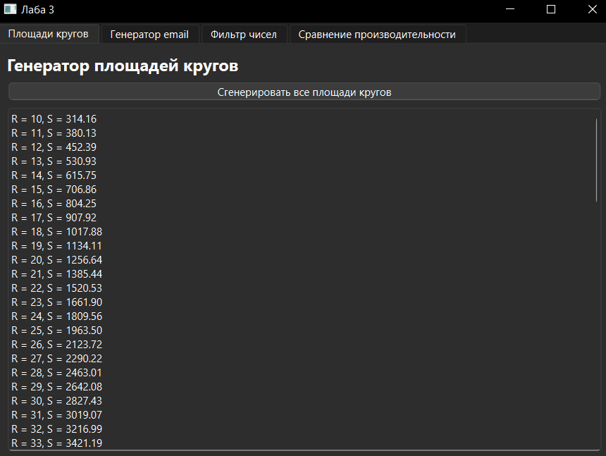
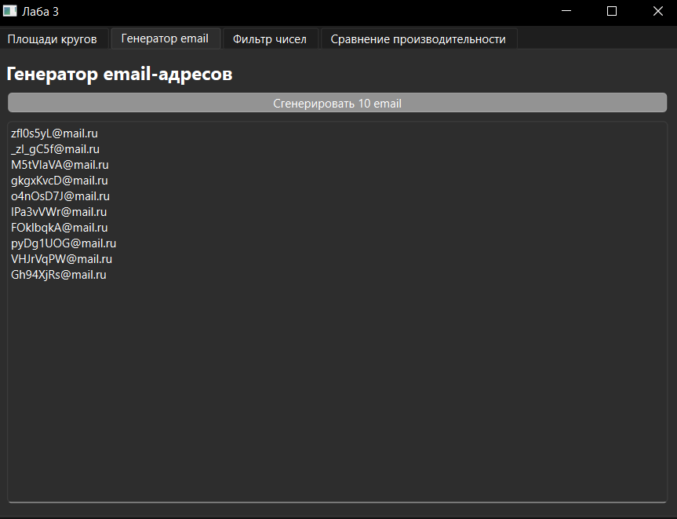
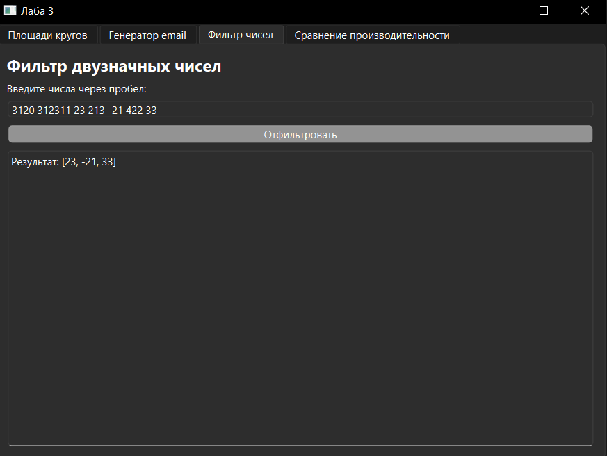
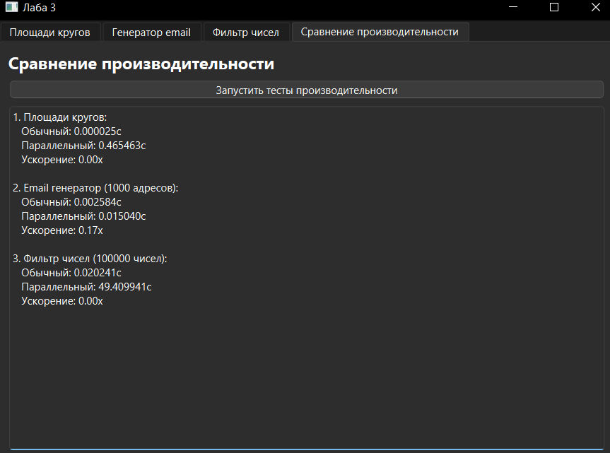

# Генераторы и фильтры данных

Проект реализует три задачи с использованием функций-генераторов Python и предоставляет графический интерфейс для удобной работы с ними.

## Описание

Приложение включает следующие функциональные модули:

### 1. Генератор площадей кругов
- Вычисляет площади кругов для радиусов от 10 до 100
- Возвращает результаты с точностью до двух знаков после запятой
- Отображает все значения в формате "R = [радиус], S = [площадь]"

### 2. Генератор email-адресов
- Создает случайные email-адреса формата xxxxxxxx@mail.ru
- Использует символы: латинские буквы (верхний и нижний регистр), цифры и подчеркивание
- Генерирует 10 адресов по запросу пользователя

### 3. Фильтр двузначных чисел
- Принимает строку целых чисел, разделенных пробелами
- Фильтрует и возвращает только двузначные числа
- Сохраняет исходный порядок элементов

### 4. Сравнение производительности
- Сравнивает время выполнения обычных и параллельных версий алгоритмов

## Запуск

Перед запуском установите зависимости
```
pip install -r requirements.txt
```

Для запуска зайдите из директории проекта напишите
```
python main.py
```

## Интерфейс
Интерфейс имеет 4  вкладка, которые соответствуют своему заданию







